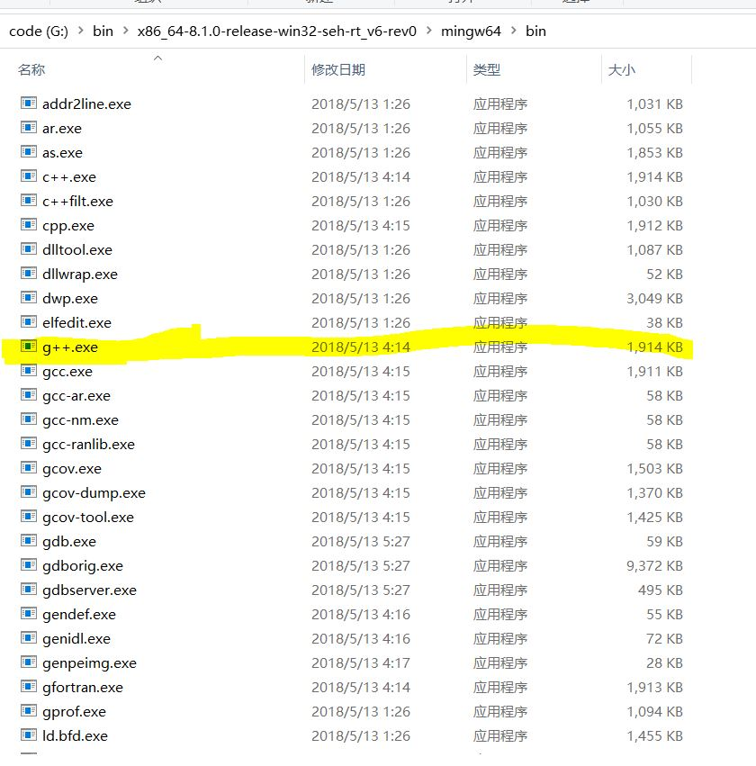
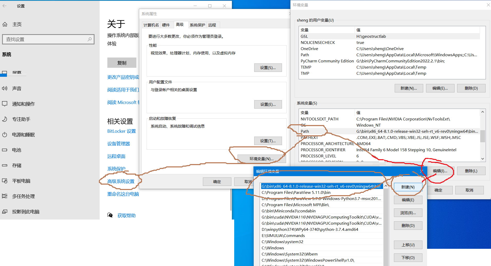

# C++环境配置(Windows系统)

下载安装MinGW-w64详细步骤（c/c++的编译器gcc的windows版）

MinGW 的全称是：Minimalist GNU on Windows ，实际上是将gcc（c/c++编译器）移植到了 Windows 平台下，并且包含了 Win32API ，因此可以将源代码编译为可在 Windows 中运行的可执行程序。而且还可以使用一些 Windows 不具备的，Linux平台下的开发工具。

选择它的原因：

1. MinGW-w64 是开源软件，可以免费使用。
2. MinGW-w64 由一个活跃的开源社区在持续维护，不会过时。
3. MinGW-w64 支持最新的 C语言 标准。
使用 Windows 的C语言运行库，因此编译出的程序不需要第三方 DLL ，可以直接在 Windows 下运行。
总之就是要在windows运行c/c++按就对了。可以理解为c/c++的编译器gcc的windows版。


## I. 安装 MinGW

1.  下载 MinGW 64 位安装包：[x86_64-win32-seh](https://sourceforge.net/projects/mingw-w64/)

    或者去百度网盘下载 x86_64-8.1.0-release-win32-seh-rt_v6-rev0.7z

    + 链接： https://pan.baidu.com/s/1rdpGMcRD6ovNzDCUycXu7Q?pwd=zdem  
    + 提取码：``zdem``


2.  解压 `x86_64-8.1.0-release-win32-seh-rt_v6-rev0.7z` ， 可以在bin文件夹中找到 `g++.exe` 编译器

    


3. 右键-我的电脑-属性-高级系统设置-环境变量-找到PATH环境变量，将g++.exe所在目录 `G:\bin\x86_64-8.1.0-release-win32-seh-rt_v6-rev0\mingw64\bin` 写入 `PATH` 环境变量

	
	
4.  测试 g++

    安装完成后，点击“开始”→“所有程序”→“附件”→“命令提示符”以启动 CMD。
    在 CMD 窗口中敲入 ``g++ -v``，若出现如下内容，则表示 C++ 环境配置成功。

	```
	Microsoft Windows [版本 10.0.19045.2486]
	(c) Microsoft Corporation。保留所有权利。

	C:\Users\sheng>g++ -v
	Using built-in specs.
	COLLECT_GCC=g++
	COLLECT_LTO_WRAPPER=G:/bin/x86_64-8.1.0-release-win32-seh-rt_v6-rev0/mingw64/bin/../libexec/gcc/x86_64-w64-mingw32/8.1.0/lto-wrapper.exe
	Target: x86_64-w64-mingw32
	Configured with: ../../../src/gcc-8.1.0/configure --host=x86_64-w64-mingw32 --build=x86_64-w64-mingw32 --target=x86_64-w64-mingw32 --prefix=/mingw64 --with-sysroot=/c/mingw810/x86_64-810-win32-seh-rt_v6-rev0/mingw64 --enable-shared --enable-static --disable-multilib --enable-languages=c,c++,fortran,lto --enable-libstdcxx-time=yes --enable-threads=win32 --enable-libgomp --enable-libatomic --enable-lto --enable-graphite --enable-checking=release --enable-fully-dynamic-string --enable-version-specific-runtime-libs --disable-libstdcxx-pch --disable-libstdcxx-debug --enable-bootstrap --disable-rpath --disable-win32-registry --disable-nls --disable-werror --disable-symvers --with-gnu-as --with-gnu-ld --with-arch=nocona --with-tune=core2 --with-libiconv --with-system-zlib --with-gmp=/c/mingw810/prerequisites/x86_64-w64-mingw32-static --with-mpfr=/c/mingw810/prerequisites/x86_64-w64-mingw32-static --with-mpc=/c/mingw810/prerequisites/x86_64-w64-mingw32-static --with-isl=/c/mingw810/prerequisites/x86_64-w64-mingw32-static --with-pkgversion='x86_64-win32-seh-rev0, Built by MinGW-W64 project' --with-bugurl=https://sourceforge.net/projects/mingw-w64 CFLAGS='-O2 -pipe -fno-ident -I/c/mingw810/x86_64-810-win32-seh-rt_v6-rev0/mingw64/opt/include -I/c/mingw810/prerequisites/x86_64-zlib-static/include -I/c/mingw810/prerequisites/x86_64-w64-mingw32-static/include' CXXFLAGS='-O2 -pipe -fno-ident -I/c/mingw810/x86_64-810-win32-seh-rt_v6-rev0/mingw64/opt/include -I/c/mingw810/prerequisites/x86_64-zlib-static/include -I/c/mingw810/prerequisites/x86_64-w64-mingw32-static/include' CPPFLAGS=' -I/c/mingw810/x86_64-810-win32-seh-rt_v6-rev0/mingw64/opt/include -I/c/mingw810/prerequisites/x86_64-zlib-static/include -I/c/mingw810/prerequisites/x86_64-w64-mingw32-static/include' LDFLAGS='-pipe -fno-ident -L/c/mingw810/x86_64-810-win32-seh-rt_v6-rev0/mingw64/opt/lib -L/c/mingw810/prerequisites/x86_64-zlib-static/lib -L/c/mingw810/prerequisites/x86_64-w64-mingw32-static/lib '
	Thread model: win32
	gcc version 8.1.0 (x86_64-win32-seh-rev0, Built by MinGW-W64 project)

	```


小白用户可以参考以下内容： https://blog.csdn.net/jjxcsdn/article/details/123058745 


