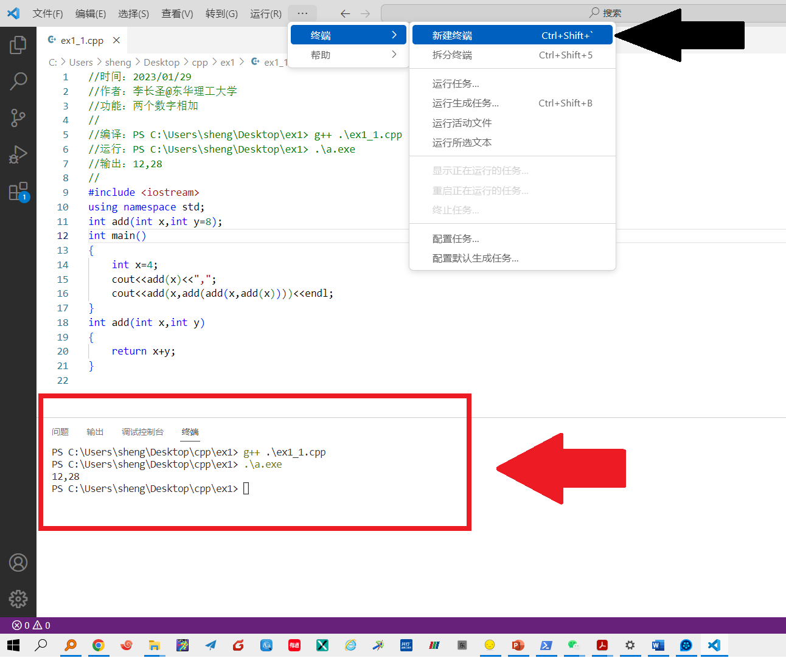

## C++代码编辑器配置

本课程采用 ``vscode`` 作为代码（文本）编辑器， ``GCC`` 作为C++编译器。
- 注意： windows的CMD、（powershell）终端均理解为一种命令行窗口，我们在命令行窗口中，均可调用 ``g++`` 来编译我们的c++代码。

1. 下载vscode，自行安装。下载地址： https://code.visualstudio.com/
2. 打开vscode, 在菜单栏中选择 ``终端-新建终端`` ，在vscode中打开（powershell）终端。**说明：vscode把命令行窗口内嵌到了软件中，方便在vscode中调用g++来编译我们的c++代码。**
3. 测试是否可以正常调用 ``g++`` （属于GCC中专门编译c++的编译器）。在终端中输入如下代码，查看能否正常编译 ex1_1.cpp，输出如图所示内容即说明vscode配置无误。


	
```
//ex1_1.cpp
//时间：2023/01/29
//作者：李长圣@东华理工大学
//功能：两个数字相加
//
//编译：PS C:\Users\sheng\Desktop\ex1> g++ .\ex1_1.cpp
//运行：PS C:\Users\sheng\Desktop\ex1> .\a.exe
//输出：12,28
//
#include <iostream>
using namespace std;
int add(int x,int y=8);
int main()
{
	int x=4;
	cout<<add(x)<<",";
	cout<<add(x,add(add(x,add(x))))<<endl;
}
int add(int x,int y)
{
	return x+y;
}

```	
	

vscode中文设置参考以下内容： https://zhuanlan.zhihu.com/p/383252071


