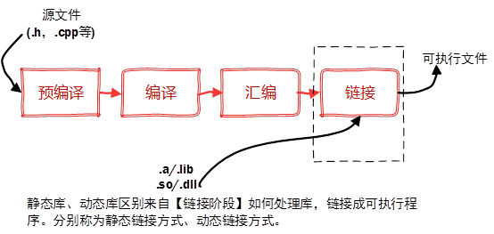

## g++编译过程





生成一个可执行文件。包括两部分：编译阶段，链接阶段。
- 编译阶段包括三个步骤。预处理，编译，汇编 ----> 生成obj文件；
- 链接阶段对obj文件的合并，生成exe可执行文件。

g++在对源程序执行编译工作时，需要经过以下四个步骤：(其中 `-o` 可以理解为将生成的文件重命名的作用）

1. 预处理：对源程序中的宏定义、包含头文件等进行处理，生成后缀名为.i的文件（使用）

	```
	g++ -E hello.cpp -o hello.i
	```  
	hello.cpp是需要编译的源文件，-o 选项指定输出的文件名。这里使用-E选项编译生成hello.i 文件

2. 转化为汇编文件：使用-S 选项，可以将预处理之后的.i文件转换为目标机器的汇编代码.S文件

	```
	g++ -S hello.i -o hello.s
	```  
	使用该参数可以将.i 文件编译生成.s 文件，输出文件名同样使用-o 选项指定。

3. 汇编文件->目标文件，即转换为机器代码：使用-c选项
	```
	g++ -c hello.s -o hello.o
	```  
4. 链接：将上一步产生的目标文件链接为可执行文件，使用-o参数

	静态链接 `ld -e main hello.o -o hello.exe` 为入口函数，.o文件为需要链接的obj文件。 *这一行命令会弹出很多错误信息，因为你没有给出完整的依赖库，实际链接过程较为复杂，这里不做要求，仅了解g++编译链接过程即可，刚兴趣的同学自行搜索相关资料。*

	**以上过程是g++工具编译cpp源程序的具体过程，在实际使用时我们可以不用按照流程一步步编译，可以一步到位将源程序编译为可执行文件，只需要使用如下命令：**
	```
	g++ hello.cpp -o hello.exe
	```  

	+ -o：指定生成可执行文件的名称。使用方法为：g++ -o afile file.cpp file.h … （可执行文件不可与待编译或链接文件同名，否则会生成相应可执行文件且覆盖原编译或链接文件），如果不使用-o选项，则会生成默认可执行文件a.out。
	+ -c：只编译不链接，只生成目标文件。
	+ -g：添加gdb调试选项。

	

参考：
- https://blog.csdn.net/i_love_kbb/article/details/126196876
- https://zhuanlan.zhihu.com/p/504742628
- https://blog.csdn.net/weixin_43953700/article/details/124890088


