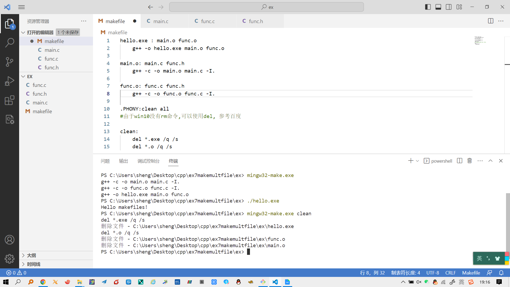

## make入门教程 (采用 mingw32-make.exe)

上一节，我们已经学习了如何用g++编译单个`.cpp`文件。如果有多个 `.cpp` 文件我们如何来编译我们的程序呢？
Makefile是一种方便的组织代码编译方式。下面我们来创建自己的makefile，编译并链接多个`.cpp` ，生成可执行程序。

## 一个简单的例子

首先举一个简单的例子，在项目文件夹中有三个文件: `main.c` ，`func.c` ，`func.h` ，分别代表着主程序，函数实现和对应的头文件。

`main.c`

```
// main.c
#include <stdio.h>
#include "func.h"
int main() {
	sayHello();
	return 0;
}
```

`func.h`

```
// func.h
void sayHello();
```

`func.c`

```
// func.c
#include <stdio.h>
#include "func.h"
void sayHello() {
	printf("Hello makefiles!\n");
}
```

一般情况下，我们将使用以下命令来编译这个项目：

```
g++ -o hello.exe main.c func.c -I.	# 注意最后的点代表当前目录
```

这条命令编译了两个.c文件 `main.c` `func.c` , 并将可执行文件命名为 `hello.exe` 

- `-o` 定义生成的可执行文件的名字。
- `-I.`代表gcc将在当前目录（.）寻找包含的头文件. 

当只有轻微的改动时适当修改一下这条命令就已经足够了，但当添加更多文件时，这就很麻烦了。

另外，如果你只改动了其中某一个.c文件，这条命令每次都将重新编译所有文件，对于大项目来说效率很低，所以这才需要makefile.

## 1 Makefile

```
hello.exe : main.c func.c
	g++ -o hello.exe main.c func.c -I.
```

将这条规则写进一个名为makefile的文件，然后在 vscode 终端中键入 `mingw32-make.exe` 就可以执行文件中的第一条规则了。其中冒号:后面放置的是规则 `hello.exe` 所依赖的文件，当这些文件改动时，规则 `hello.exe` 会被重新执行。这里没有放置头文件，所以即使头文件改变，命令行中键入 `mingw32-make.exe` ，这条规则也不会被执行。当然，就目前来说，这条规则效率很低。

需要注意的是，在g++命令前有一个tab制表符，在任何命令前都必须有个tab制表符。



- make 这个软件有很多不同的版本，用来支持各种系统。 `mingw32-make.exe` 是 make 在 win10 下的一个版本。
- `mingw32-make.exe` 和你之前配置的 g++ 在同一位置，之前配置了 g++ 的环境变量，就不用配置 mingw32-make.exe 的环境变量了


## 2 Makefile

```
hello.exe : main.o func.o
	g++ -o hello.exe main.o func.o
```

这里我们通过把目标文件 `main.o` 和 `func.o` 放置在规则依赖列表中，make将链接目标文件 `main.o` `func.o` 生成可执行文件 `hello.exe` 。

这样的makefile足够应对小型项目，但是像之前提到的：依赖文件中没有包含头文件，所以头文件改变后make将不会重新编译.c文件。为了修补这个问题，我们需要将头文件加入到依赖列表中。如下所示：

```
hello.exe : main.o func.o
	g++ -o hello.exe main.o func.o
	
main.o: main.c func.h
	g++ -c -o main.o main.c -I.
	
func.o: func.c func.h
	g++ -c -o func.o func.c -I.
```

- `-c` 指出仅生成目标文件 `.o` 
- `-o` 指出生成的目标文件的名字。

make将先编译并生成目标文件 `func.o` 和 `main.o` ,之后， 链接这两个文件生成可执行文件 `hello.exe`

## 3 makefile 完整的例子

工作目录中的文件

```
-|
 |---func.h
 |---func.c
 |---main.c
 |---makefile
```

makefile

```
hello.exe : main.o func.o
	g++ -o hello.exe main.o func.o
	
main.o: main.c func.h
	g++ -c -o main.o main.c -I.
	
func.o: func.c func.h
	g++ -c -o func.o func.c -I.
 
.PHONY:clean all

#由于win10没有rm命令,可以使用del, 参考百度
clean:
	del *.exe /q /s
	del *.o /q /s
```

`main.c`

```
// main.c
#include <stdio.h>
#include "func.h"
int main() {
	sayHello();
	return 0;
}
```

`func.h`

```
// func.h
void sayHello();
```

`func.c`

```
// func.c
#include <stdio.h>
#include "func.h"
void sayHello() {
	printf("Hello makefiles!\n");
}
```

在 vscode 终端中，执行如下命令编译、运行、清理程序

- `mingw32-make.exe` 编译生成exe
- `./hello.exe` 运行程序
- `mingw32-make.exe clean` 删除可执行程序 `exe` 和目标文件 `.o` 。注意到以上的makefile中我们定义了clean规则，所以这里可以执行clean规则。

执行过程如下图：




参考：https://blog.csdn.net/qq_35754154/article/details/127432564  
**如果学习完本实例，仍然没有懂make使用方法，建议自己百度make教程学习。**


